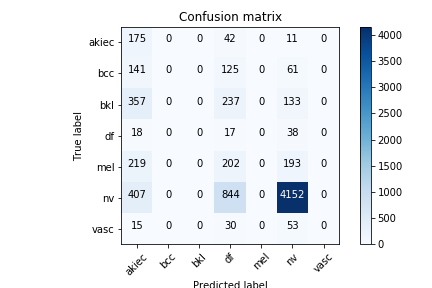

# Exploring HAM 10000 Skin Cancer Dataset
2019.07.13 - 2019.07.14

## Report structure
The report is focused on
1) getting initial dataset and skin cancer diagnostics understanding
1) planning product development process that allows short iteration-feedback loop
1) prototyping base solution to have enough data to discuss with dermatologists

In my experience, understanding strategic goals and developing step by step approach on how to reach them gives much more results than concentrating on model building as a task in itself. I see modeling as a part of product development cycle: business goals - data gathering - modeling - evaluation - production. Modeling is very much dependant on such factors as: who will be users of the model -patients or doctors, what budget we have in the company, what is the optimal balance between quality of improved diagnostics and its cost, application methods - online or embedded into diagnostics systems, etc 

To sum up, it is really important to specify the problem itself as this heavily impacts data preparation, modeling, evaluation and deployment.

## Getting initial data understanding
### First look at the data allowed for the conclusions below:
- 7470 pigmented lesions with 1-6 images each, 10015 lesion images in total
- Each lesion described with lesion's localization, patient's age and sex, and how the diagnosis was obtained
- 7 different diagnosis, highly unbalanced class size. Most common lesion type in dataset with 5400 examples is melanocitic nevi. Least common is dermatofibroma having 73 examples.
- Lesion types distribution significally differs for males and females. For instance, melanoma is significantly more common among males then among female (for significance level 0.5%). It means that patient's sex is a valuable feature for diagnostics. The same holds for patient age and lesion localization.

### Diving into [dataset descriptor paper](https://arxiv.org/ftp/arxiv/papers/1803/1803.10417.pdf "Tschandl, P. et al. The HAM10000 dataset, a large collection of multi-source dermatoscopic images of common pigmented skin lesions. Sci. Data 5:180161 doi: 10.1038/ sdata.2018.161 (2018).")
- Blurry and insufficiently scaled images, non-pigmented lesions are removed from the dataset
- Dataset is thoroughly verified: Each diagnosis has been verified for plausibility by two specialists independently and lesions with implausible diagnoses are removed.
- Treatment for various diagnoses varies from doing nothing or follow-up to taking biopsy and excision the lesion as soon as possible. It means that 1) correct diagnoses save much work, time, money and is beneficial for patient's health and 2) impact level of wrong diagnosis varies very heavily depending on what is the true lesion type and what type is predicted.
- About 95% of pigmented lesions types are covered by the dataset while more rare types are excluded.
- Such features of lesions as: structure symmetry, color and quantity of colored inclusions, are important for correct diagnostics. For better problem solving, our model should extract these features. 

### Validating lesion types representation in dataset
Lesion type frequences in the dataset does not represent real world frequences.

For instance, [Skin cancer foundation](www.skincancer.org) statistics tells us that pigmented basal cell carcinoma is 6 times more common then pigmented melanoma in the USA. Even if proportion is different in other countries, it is highly unlikely for melanoma to be 2 times more common in the dataset.

It means that before evaluating the model, class weights should be defined to match actual lesion types frequences.

## Basic business understanding
This chapter contains only generic ideas. The list should be complemented after interviewing doctors and patients. Existing items should be specified after interviewing the doctors, obtaining skin cancer diagnostics details and statistics and getting feedback from experts.

### Generic problems in skin cancer diagnostics and probable solutions
Problem | Solution | Application | Effect
--- | --- | --- | ---
Treatment cost is high | Build a model that detects a specific malignant lesion type with same sensitivity (true positive rate) as human experts but higher specificity (true negative rate)| Use model as a "second opinion" tool for dermatologists | Less benign lesions are to be biopsyed or excised leading to lower treatment and after-treatment costs. Also, lower impact on health of patients with benign lesions
Not enough dermatologists, patients have to wait for diagnosis | Build a model that classifies malignant lesions over benign ones with very high specificity | Images are taken by junior medical personnel or physicians, processed on the remote server at the time of examination, patients with easiest benign lesions do not have to be examined further, other patients are routed to specialists | Part of the patients are handled by junior medical personnel, the time of specialists is used more effectively, patients spend less time waiting for diagnostics
Dermatologists are unavailable e.g. in rural or remote areas | same as previous | same as previous | Basic diagnostics is accessible even in rural and remote areas
Patients want to verify their diagnosis | Find out cost and impact on health of misclassification for each (true class, predicted class) pair and train model that performs comparable to human experts | Make an online tool to classify dermatoscopic images | Accessible "second opinion" leads to lower rate of medical errors which is beneficial for society. Also it is a strong marketing tool for company

## Building model prototype
This chapter aims to build a prototype and describe it in a way that is can be interpreted by doctors. No fine-tuning here, it is too early for this - problems to be solved are yet to be chosen and evaluation metrics are tightly connected with them. So the goal is to build a model to interview medical community experts (dermatologists, oncologists) and validate it. During such a discussion we will focus on areas of application, comparative analysis with human diagnostics, artefacts, other input from experts. 

The process of building prototype is described below. 

### Exploring different model architectures / hyper parameter settings and compare their performance.

4 models were built. They are similar but differ by set of used features. 
Model 1 - logistic regression, Models 2-4 - are convolutional neural networks (CNN) based on DenseNet121 architecture. 

1. Logistic regression on one-hot encoded sex, age and lesion's localization. Images are ignored.

2. Use frosen pretrained DenseNet121 to extract features from images, train logistic regression upon these features. Sex, age and lesions's localization are ignored.
    
    Metrics values: TODO

3. Finetuning pretrained DenseNet121 with last fully-connected layer changed to match actual class count. Sex, age and lesions's localization are ignored.

4. Use all features: features are extracted from with pretrained DenseNet121 with last fully-connected layer removed, concatenated with one-hot encoded sex, age and lesion's localization and a fully connected layer stacked upon them.

### Small data set size implications on choices to solve the problem
1) Image feature extractors are underfitted because input is not very diverse. This may be overcome by using transfer learning - CNN initialized with a good initial point trains faster and usually performs better. Also image augmentation increase input diversity. In this work images augmented with random rescaling, rotation and reflection to imitate making image from different angles and with various magnification.
2) Add data from other datasets (not done in this report)
3) When comparing models with very close performance, sometimes we have to use k-fold validation or even repeated k-fold validation to lower p-value and confidence interval for metrics (not done in this report).

### Selection and description of a suitable set of training techniques.
- data augmentation: images are randomly rotated, cropped and resized. Sex, and location are one-hot encoded. Age is encoded as several 0/1 columns: (age <= 0), (age <= 5), (age <= 10) and so on to presume age order. Missing values are filled with column mean.
- save model at the epoch that gives best result on validation set
- decrease learning rate reaching plateau

### Suggestion of a performance metric for the model and explaining its clinical relevance
First thing I deduplicated descriptions of lesions that have several images. Specifically, images of same lesion were grouped into single list. This removes bias made by duplicated sex, age and lesion localization.

Interpretable metrics:
- sensitivity and specificity for each class evaluated on validation data

    These two metrics allow us to compare human experts with the model and also to tune class weights to transform logits to class label.

- confusion matrix evaluated on validation data

    As we use the model in order to define treatment type for patients it is important what type of mistakes model makes. Each non-diagonal item negatively impacts patient's health, spends time of patient and doctors and increase treatment cost. But actual mistake cost varies: 
    - For example, if melanocytic nevi is misclassified as dermatofibroma - there is no impact on health as they are both benign.
    - If melanocytic nevi is misclassified as melanoma - it will be excised. The impact on health varies from 3 days of post-treatment to 14 days of post-treatment and possible complications. 
    - If malanoma is misclassified as melanocytic nevi, it will be left untreated for about 6-12 months until next examination. This time is critical for melanoma patients. Late start of treatment makes it much more costly and less efficient.

    Having these losses (time, treatment cost, impact on patient health) estimated and put in the same scale, we can evaluate how well our models solves specific business goals. This helps us greatly to specify optimization problem and minimize cumulative costs.

More sensitive (but sadly not interpretable) metrics:
- mean difference between predicted probability of the true class and predicted probability of the predicted class

All models we build here optimize cross-entropy internally, so it will also be included in statistics.
- cross-entropy

### Specify a verification method for the final model and verify the model. You can split the dataset as you wish but motivate and explain your choices.
Group different images of same lesion and then cross-validate with stratified 3-fold. Validation images are augmented the same way as training set.
Stratification is used to fight class imbalance, and there only 3 folds to increase training speed.

TODO: statistical significance of the verification results.

### Visualize the results and the learning procedure.
TODO: paste images
